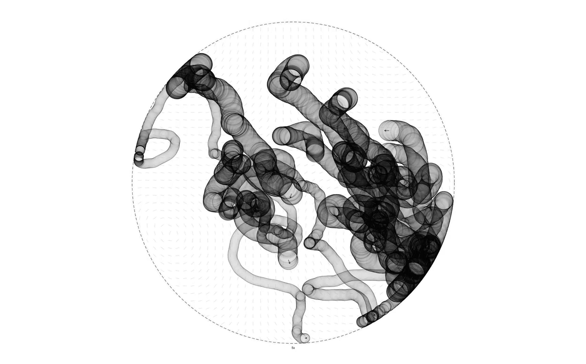

## WETLAND BUMPER CARS SIMULATION
simulates a fleet of drifting floating wetlands in Lake Ronkonkoma, developed as part of the Advanced IV Architecture Studio at GSAPP. The wetlands behave like a field of bumper cars, moving freely across the lake's surface while responding to three abstracted forces: wind, tidal motion, and self-collisions between units.

### MINIMAL CONTROLS

Click outside the dotted boundary to toggle motion trail clones.  
Click inside the dotted boundary to show or hide the flow field visualization.  
Click “1x” at the bottom of the boundary to cycle simulation speed.  
Press the space bar to display a GIF of the design precedent.

